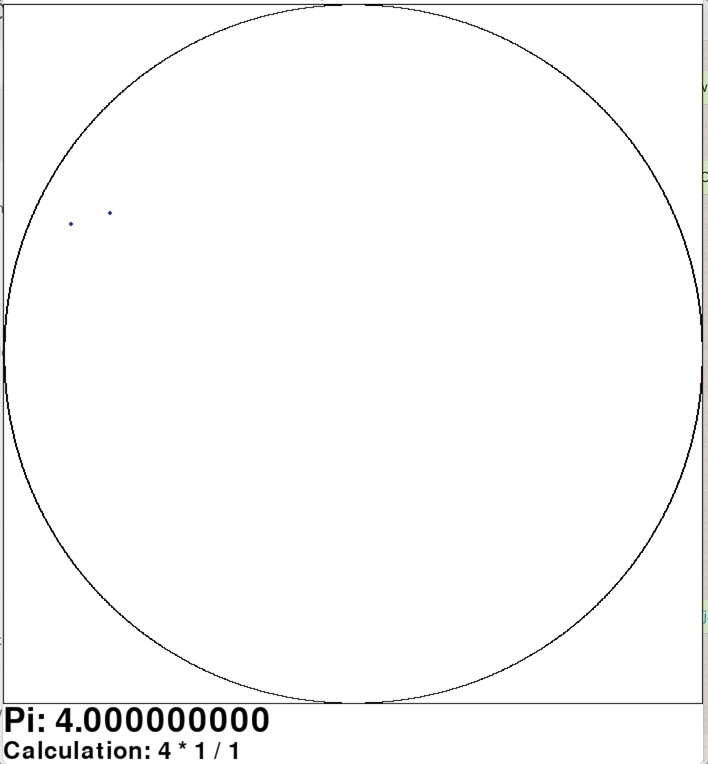

# Calculating pi using a Monte Carlo method with pygame UI

A **circle** with radius R will have an area of **πr 2**.

A **square** with side lengths 2R will have an area of **4r2**.

The ratio of the area of a circle with radius R and a square with side lengths 2R is therefore **π/4**.

We can use this ratio to compute an approximation of pi using a Monte Carlo method. By placing the circle inside the square and randomly placing points in the square, we can compute pi as: **π = (4 * points in circle) / total points**.

This code provides a visualisation tool to see this relationship.

<!--Default image size is 708 764-->

## Setup

In terminal (mac) or command prompt (windows) clone the repository with:
* `git clone https://github.com/jackedison/Pi_Monte_Carlo`

Then change directory to the cloned repository:
* `cd Pi_Monte_Carlo`

### To run

Once cloned to a local repository, simply run `python pi_monte_carlo.py` to play the run the pygame interface.

*Note: This will require pygame==1.9.6+ (pip install pygame)*